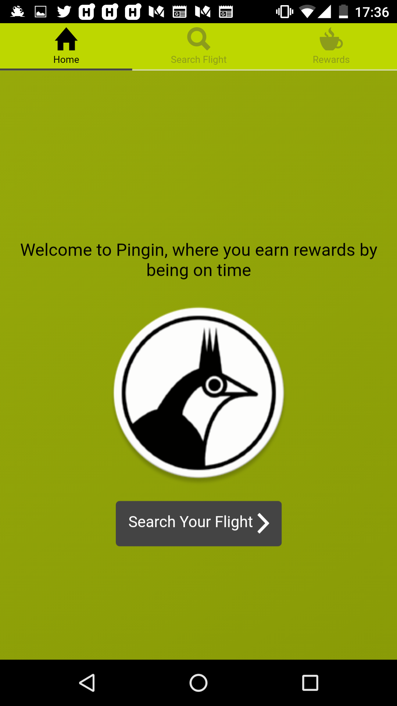
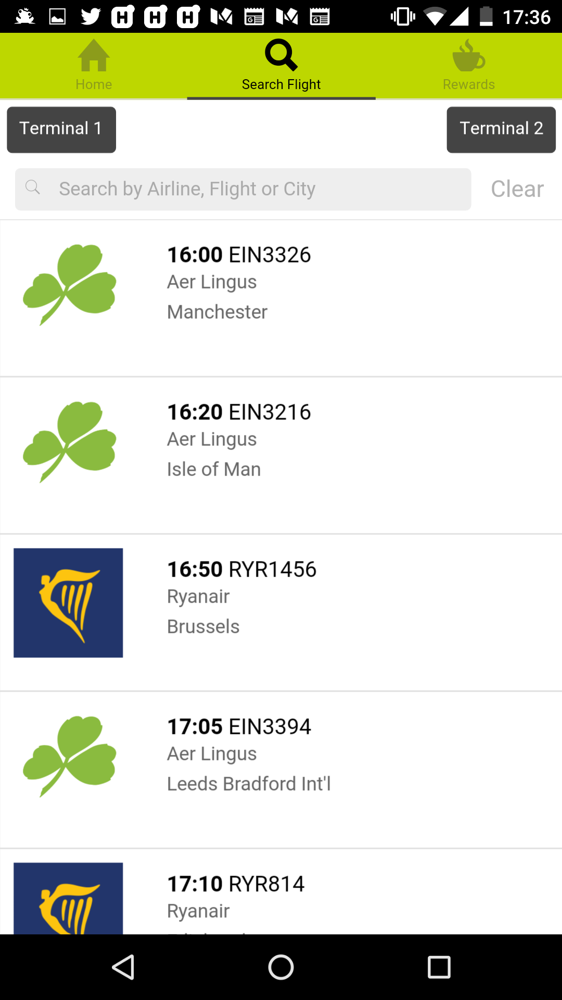
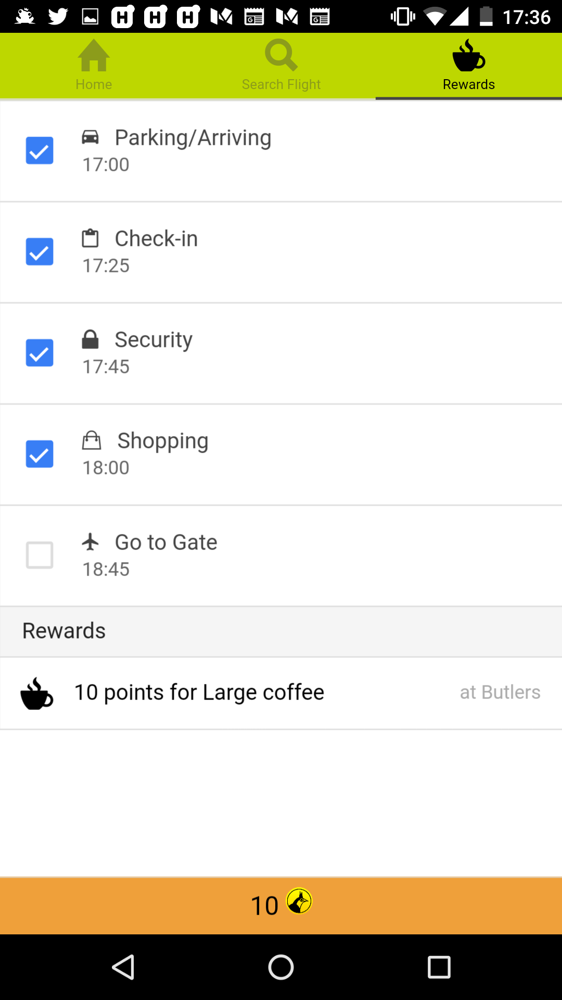
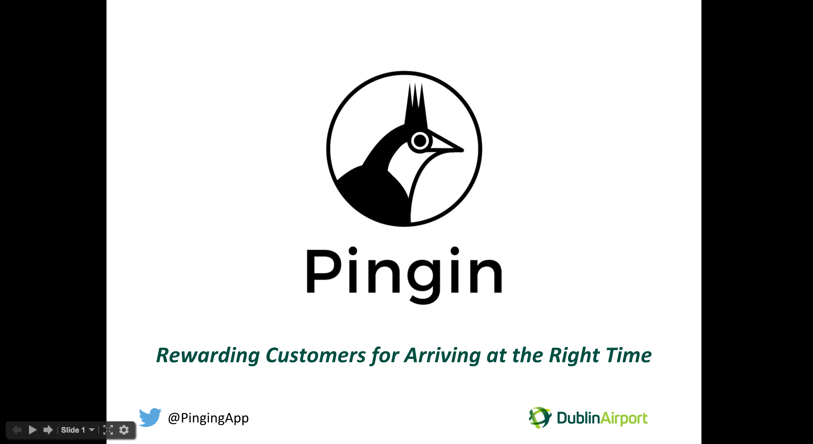

# Pingin

"Don't be an angry bird, be an early bird".
Mobile app which Rewards Customers for Arriving at the Right Time.

https://twitter.com/pinginapp

# Screenshots

  

# Our pitch

## Tech

  - Ionic 1.x
  - https://github.com/chariotsolutions/phonegap-nfc
  - Based on https://github.com/jdnichollsc/Ionic-Starter-Template/

### Hacked at:
http://dublinairport-hackathon.com/

### Todo:

  - [x] NFC can only tick the checkbox
  - [x] Read NFC tag and open app
  - [ ] Calculate time where to be there (API?)
  - [ ] Animate check-in
  - [ ] Get airline names in API (SETA instead of Flightaware?)
  - [ ] Cache http API requests (Angular $http)
  - [ ] Show if a is a flight delayed or on schedule
  - [ ] Swipe between tabs  [stackoverflow](http://stackoverflow.com/questions/30307162/how-to-swipe-through-different-ionic-tabs)
  - [ ] Read QR code (for iPhones)
  - [ ] Implement Geofencing for outdoor areas [ionic-geofence](https://github.com/cowbell/ionic-geofence)
  - [ ] Integrate with marketing rewarding platforms like [Kiip](http://www.kiip.me/developers/)

### Team:
  - Sean Winters - Founder/Backend - Pitch
  - Oisín Buckley - Project Manager - Pitch
  - Kilian O’Donoghue - Hardware Integration
  - Cindy Xu - Data Analyst
  - Peadar Casey - Market and Business Analyst
  - Gianfranco Palumbo - Mobile Developer

### Thanks to:

  - Logo icon by: https://thenounproject.com/term/bird/14826/
  - DCU Alpha
  - Dublin Airport
